[TOC]
# linux简介

Linux是一套免费使用和自由传播的类Unix系统，是一个基于UNIX的多用户、多任务、支持多线程和多CPU的操作系统，诞生于1991 年10 月5 日。它能运行主要的UNIX工具软件、应用程序和网络协议。Linux可安装在各种计算机硬件设备中，比如手机、平板电脑、路由器、视频游戏控制台、台式计算机、大型机和超级计算机上。


小趣闻：Linux是Linux is not unix的简称。

# linux特性

个人认为linux最大的特性是开源，用户可以通过网络或其他途径免费获得，并可以任意修改其源代码。正是由于这一点，来自全世界的无数程序员参与了Linux的修改、编写工作，程序员可以根据自己的兴趣和灵感对其进行改变，这让Linux吸收了无数程序员的精华，不断壮大。

## 与windows对比

### linux的优势

1. 更稳定、安全。（所以大部分的服务器都运行在linux之上）
2. 具有强大的终端系统，用户可以通过命令完成一切操作。
3. 更好的多用户体验
4. 更小的资源占用

### windows的优势

1. 用户界面亲民，学习成本低
2. 对硬件的兼容性更好
3. 许多专业软件or游戏只能运行在windows上

# linux基本知识

## linux的目录结构

在 Linux 或 Unix 操作系统中，所有的文件和目录都被组织成以一个根节点开始的倒置的树状结构。

文件系统的最顶层是由根目录开始的，系统使用 **/**来表示根目录。在根目录之下的既可以是目录，也可以是文件，而每一个目录中又可以包含子目录文件。如此反复就可以构成一个庞大的文件系统。

在Linux文件系统中有两个特殊的目录，一个用户所在的工作目录，也叫当前目录，可以使用一个点 **.**来表示；另一个是当前目录的上一级目录，也叫父目录，可以使用两个点 **..** 来表示。

- ** . ：代表当前的目录，也可以使用 ./ 来表示；
- ** .. ：代表上一层目录，也可以 ../ 来代表。

##系统目录结构（根目录结构）

在终端`Terminal`中运行`ls \`（`ls`是列出文件的命令，`\`是`ls`的工作路径）后，终端会列出`/`路径下的文件。其中：（初学者请直接跳至节尾）

- **/bin**：
  bin是Binary的缩写, 这个目录存放着最经常使用的命令。

- **/boot：**
  这里存放的是启动Linux时使用的一些核心文件，包括一些连接文件以及镜像文件。

- **/dev ：**
  dev是Device(设备)的缩写, 该目录下存放的是Linux的外部设备，在Linux中访问设备的方式和访问文件的方式是相同的。

- **/etc：**
  这个目录用来存放所有的系统管理所需要的配置文件和子目录。

- **/home**：
  用户的主目录，在Linux中，每个用户都有一个自己的目录，一般该目录名是以用户的账号命名的。

- **/lib**：
  这个目录里存放着系统最基本的动态连接共享库，其作用类似于Windows里的DLL文件。几乎所有的应用程序都需要用到这些共享库。

- **/lost+found**：
  这个目录一般情况下是空的，当系统非法关机后，这里就存放了一些文件。

- **/media**：
  linux系统会自动识别一些设备，例如U盘、光驱等等，当识别后，linux会把识别的设备挂载到这个目录下。

- **/mnt**：
  系统提供该目录是为了让用户临时挂载别的文件系统的，我们可以将光驱挂载在/mnt/上，然后进入该目录就可以查看光驱里的内容了。

- **/opt**：
   这是给主机额外安装软件所摆放的目录。比如你安装一个ORACLE数据库则就可以放到这个目录下。默认是空的。

- **/proc**：
  这个目录是一个虚拟的目录，它是系统内存的映射，我们可以通过直接访问这个目录来获取系统信息。
  这个目录的内容不在硬盘上而是在内存里，我们也可以直接修改里面的某些文件，比如可以通过下面的命令来屏蔽主机的ping命令，使别人无法ping你的机器：

  ```
  echo 1 > /proc/sys/net/ipv4/icmp_echo_ignore_all
  ```

- **/root**：
  该目录为系统管理员，也称作超级权限者的用户主目录。

- **/sbin**：
  s就是Super User的意思，这里存放的是系统管理员使用的系统管理程序。

- **/selinux**：
   这个目录是Redhat/CentOS所特有的目录，Selinux是一个安全机制，类似于windows的防火墙，但是这套机制比较复杂，这个目录就是存放selinux相关的文件的。

- **/srv**：
   该目录存放一些服务启动之后需要提取的数据。

- **/sys**：
   这是linux2.6内核的一个很大的变化。该目录下安装了2.6内核中新出现的一个文件系统 sysfs 。

  sysfs文件系统集成了下面3种文件系统的信息：针对进程信息的proc文件系统、针对设备的devfs文件系统以及针对伪终端的devpts文件系统。

  ​

  该文件系统是内核设备树的一个直观反映。

  当一个内核对象被创建的时候，对应的文件和目录也在内核对象子系统中被创建。

- **/tmp**：
  这个目录是用来存放一些临时文件的。

- **/usr**：
   这是一个非常重要的目录，用户的很多应用程序和文件都放在这个目录下，类似与windows下的program files目录。

- **/usr/bin：**
  系统用户使用的应用程序。

- **/usr/sbin：**
  超级用户使用的比较高级的管理程序和系统守护程序。

- **/usr/src：**内核源代码默认的放置目录。

- **/var**：
  这个目录中存放着在不断扩充着的东西，我们习惯将那些经常被修改的目录放在这个目录下。包括各种日志文件。

在linux系统中，有几个目录是比较重要的，平时需要注意不要误删除或者随意更改内部文件。

/etc： 上边也提到了，这个是系统中的配置文件，如果你更改了该目录下的某个文件可能会导致系统不能启动。

/bin, /sbin, /usr/bin, /usr/sbin: 这是系统预设的执行文件的放置目录，比如 ls 就是在/bin/ls 目录下的。

值得提出的是，/bin, /usr/bin 是给系统用户使用的指令（除root外的通用户），而/sbin, /usr/sbin 则是给root使用的指令。 

/var： 这是一个非常重要的目录，系统上跑了很多程序，那么每个程序都会有相应的日志产生，而这些日志就被记录到这个目录下，具体在/var/log 目录下，另外mail的预设放置也是在这里。


对于初学者来说，我们并不需要在意这些文件，也不要去修改/目录下的文件和目录。

之后我们的操作都在`~`目录下进行。（`~` 与`/home`等价，就是用户个人的目录）

## linux的基本操作

在终端中，什么命令都不输入的情况下，光标前面的路径代表了终端执行命令的路径。

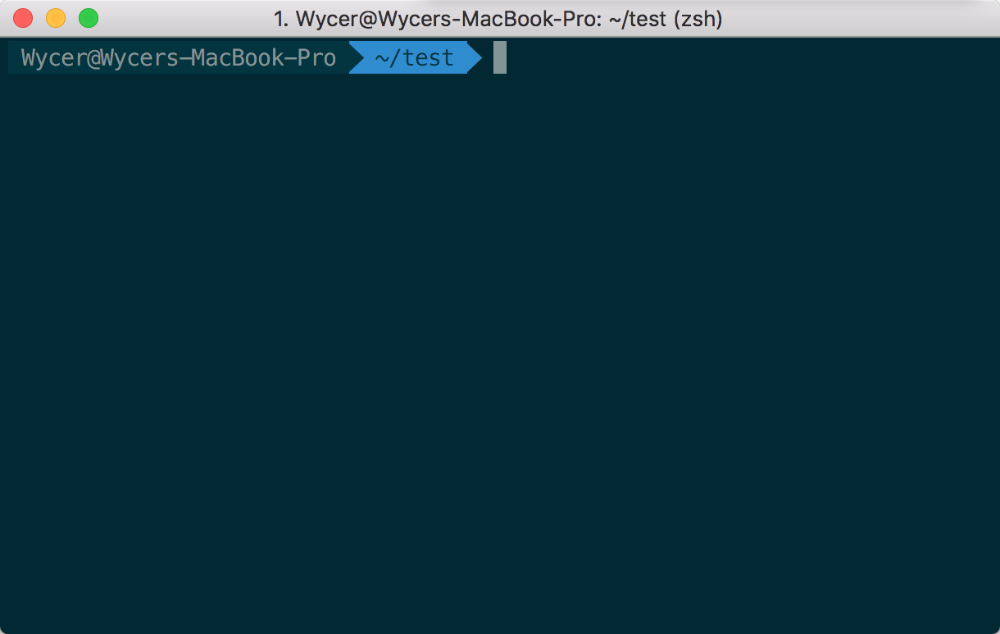

上图中终端所执行命令的路径是`~/test`，`~`与`/home`等价，`~/test`相当于`/home/test`。

### linux的命令结构

通常来说，linux的命令具有`<command> <args>`这样的结构。

例如上一节中提到的`ls /`，其中`ls`是`<command>`（命令），`/`是`<args`（参数）。

参数并不是必须的，例如只执行`ls`将默认将终端运行的目录作为参数

有的时候参数也很复杂，例如`ls -al \`，其中`-al`是`-a`和`-l`的合并，`-a`参数会让`ls`列出所有的文件，包括隐藏文件，`-l`会列出文件的详细信息……


下面我们开始学习linux的基础命令。。


### mkdir命令

mkdir是make directory的简写，mkdir命令显然用来创建目录的啦。如图，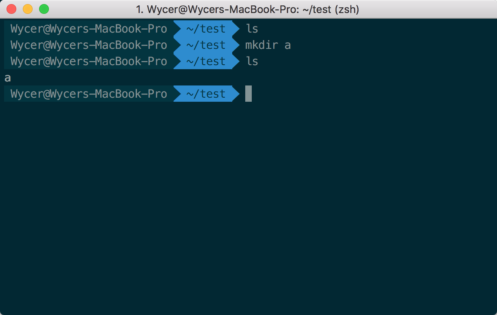

通过`mkdir a`创建了一个名字为a的目录

### rmdir命令

与mkdir类似，rmdir就是用来删除一个目录的。但是要求这个目录必须是空的

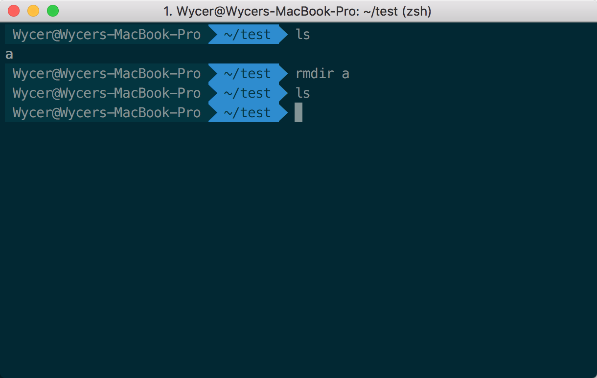

### cd命令

`cd`是Change directory的缩写，可以通过`cd`切换目录，可以用绝对路径或者相对路径作为参数。

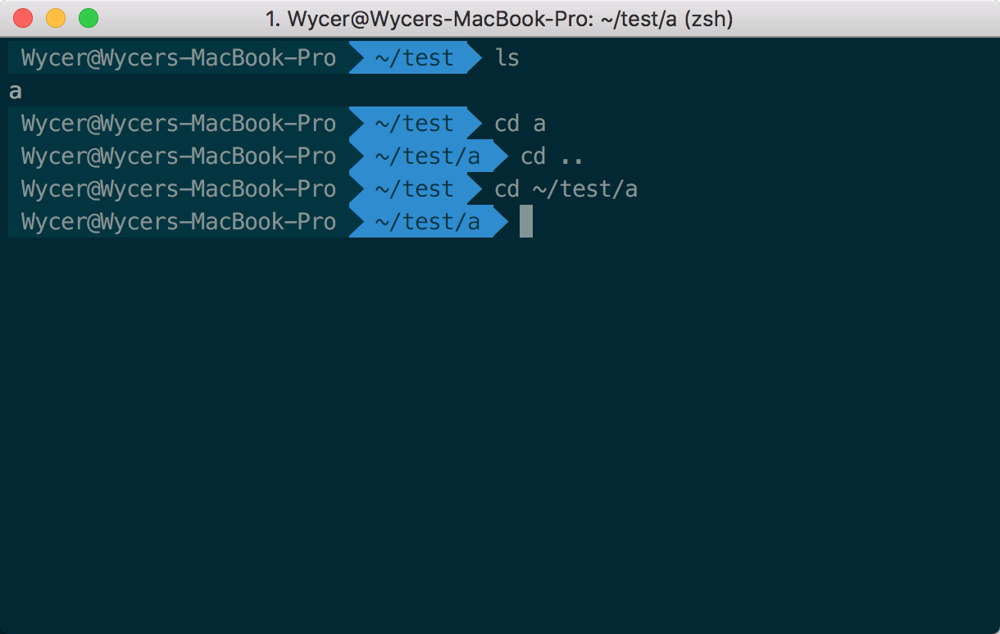

### vi命令

vi是一种linux自带的文本编辑器。vi的操作十分丰富，如果熟练掌握对编程效率提升巨大。但是这里只讲一些基本的vi操作。

执行`vi test.txt`在终端当前目录新建一个test.txt文件。

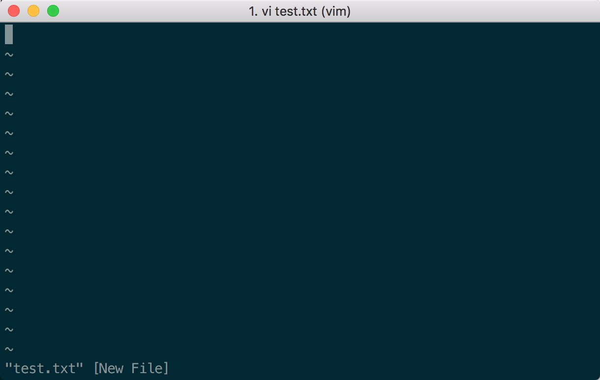

~表示没有内容。左下角显示了当前的文件名，后面的New File表示保存的时候将新建这个文件。

vi分为三个模式（命令模式，输入模式，底线命令模式），刚打开文件的时候进入的是命令模式。

在命令模式，我们可以（3个基本操作）：

- **按下按键i**，进入输入模式
- **输入:**，切换到底线命令模式
- **按下x**，删除当前光标所在处的字符

我们先进入插入模式，在插入模式，我们可以（输入文本等操作）：

- **字符按键以及Shift组合**，输入字符
- **ENTER**，回车键，换行
- **BACK SPACE**，退格键，删除光标前一个字符
- **DEL**，删除键，删除光标后一个字符
- **方向键**，在文本中移动光标
- **HOME**/**END**，移动光标到行首/行尾
- **Page Up**/**Page Down**，上/下翻页
- **Insert**，切换光标为输入/替换模式，光标将变成竖线/下划线
- **ESC**，退出输入模式，切换到命令模式

我们随意输入一些东西，比如

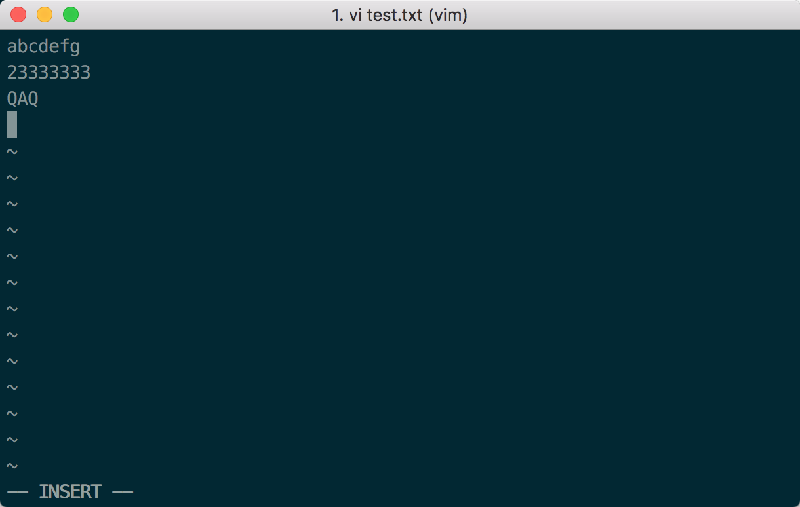

然后按`ESC`从输入模式退回到命令模式。输入`:`进入底线命令模式

在底线命令模式

我们可以输入

- **字符w**：表示**write**，即保存写入。
- **字符q**：表示**quit**，退出vi。

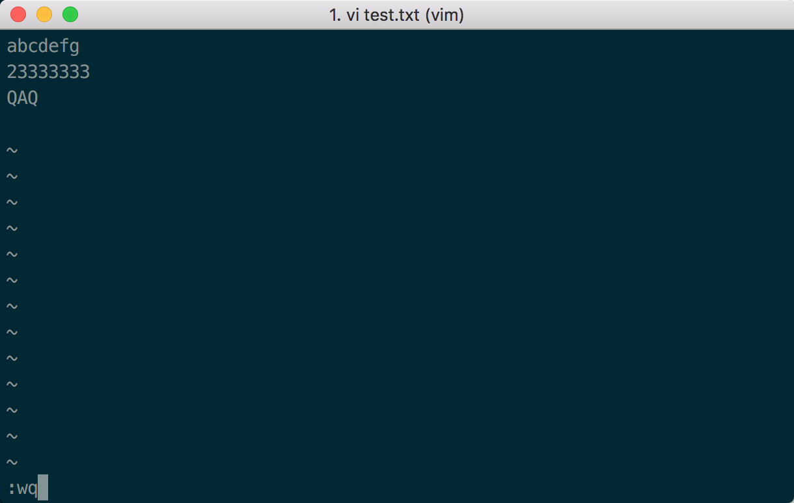

是可以直接:wq表示保存并退出的。

回车后再瞄一眼文件列表。

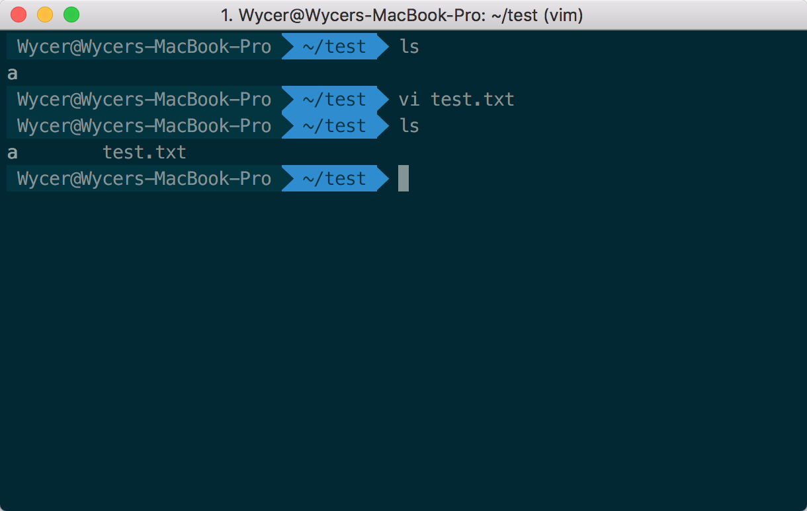

当前目录下就多了一个test.txt

### cat命令

不是猫233

我们可以输入命令`cat <filename>`来查看一个ASCII文件。例如

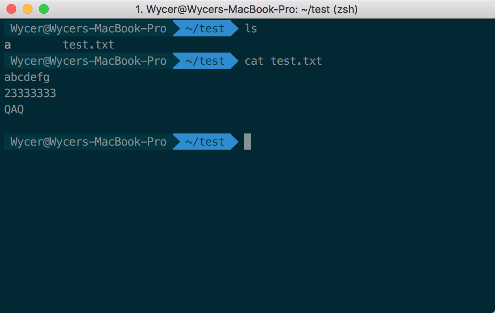

会把这个文件的内容直接在终端显示出来。

### cp命令

cp是copy的简称，这个命令用于复制文件。例如

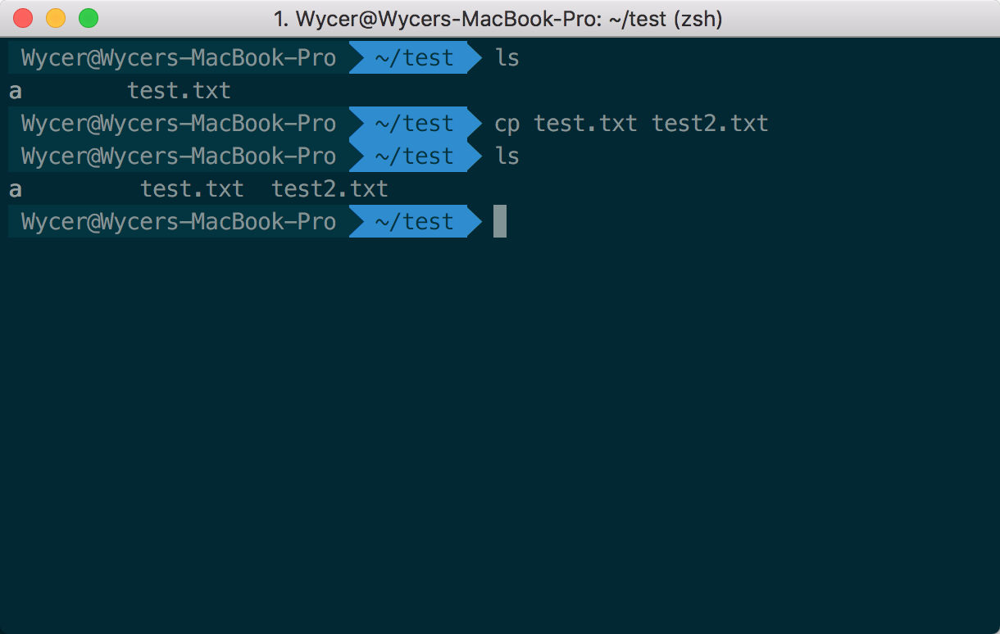

如果要复制一个目录，需要加上`-r`参数，例如：

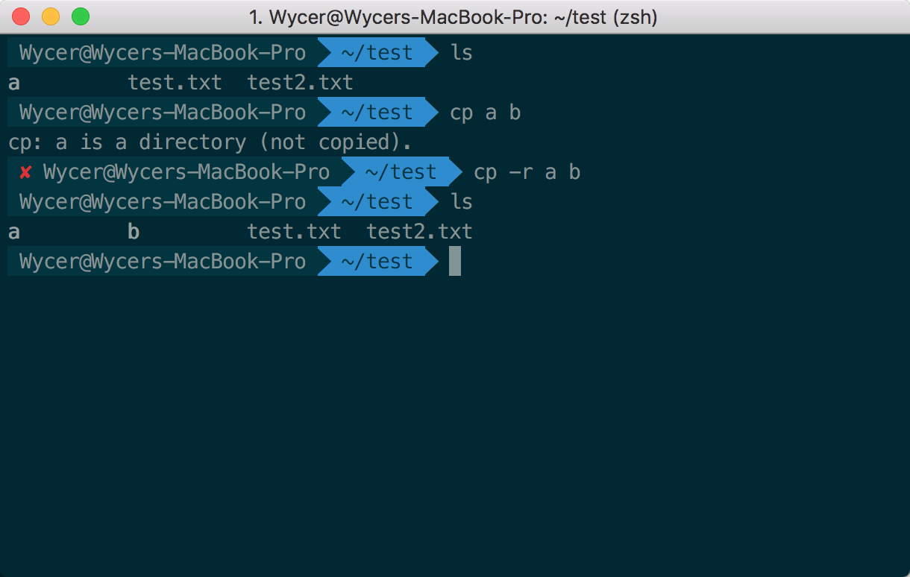

### rm命令

rm是remove的简称，用于移除文件。如果要删除一个目录，需要加上`-r`参数，例如：

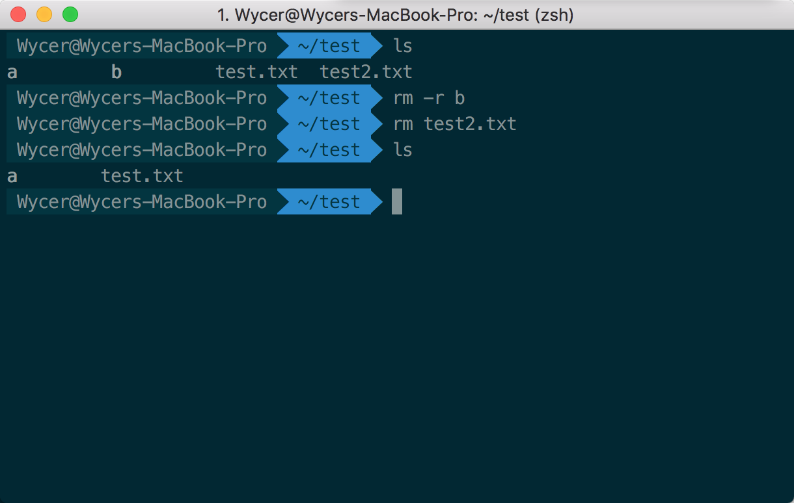

